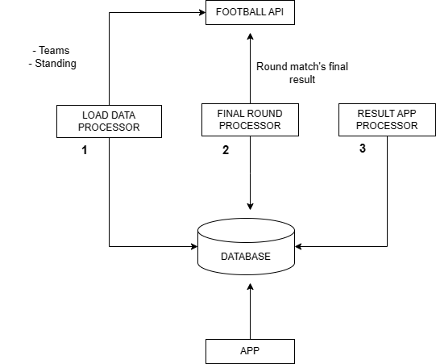

# Simulador do Brasileirão

## Funcionalidades a serem implementadas

### V1
- Geração de placares da rodada;
    - Manual
    - Automática
- Geração automática de todos os resultados do campeonato;
- Fechamento da rodada;
    - Para não ser possível alterá-los mais.
- Visualização de tabela de classificação;
- Classificação dos times por critério de desempate;
- Animação quando um time perder posição devido ao resutlado;
    - Podendo ser perder posição ou subir na tabela
### V2

- Competição entre usuários a partir da criação de ligas ( vide CartolaFC )
    - Com critérios de ranking ponderado por acerto
        - Acertar o vencedor ( pontuação x )
        - Acertar o placar ( pontuação y ) 
        - Acertar por quanto será a vitoria/derrota/empate ( pontuação z )
    
## Modelos

## Diagrama

